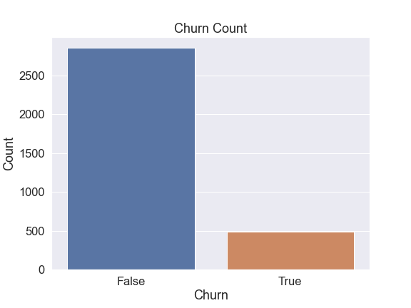
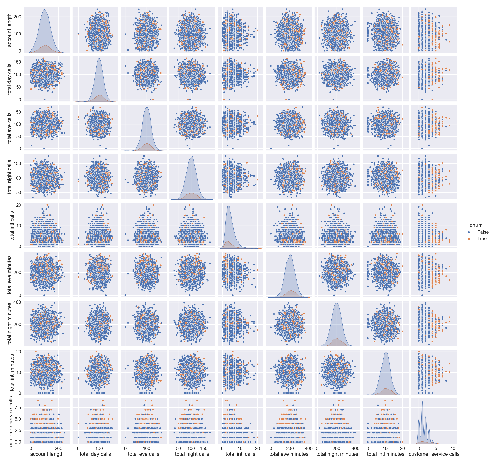
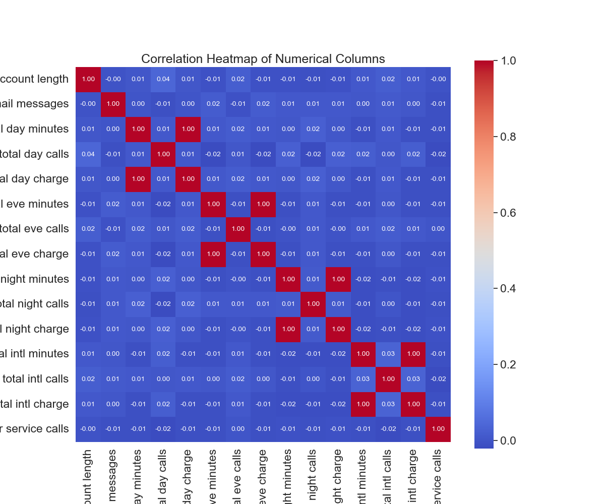
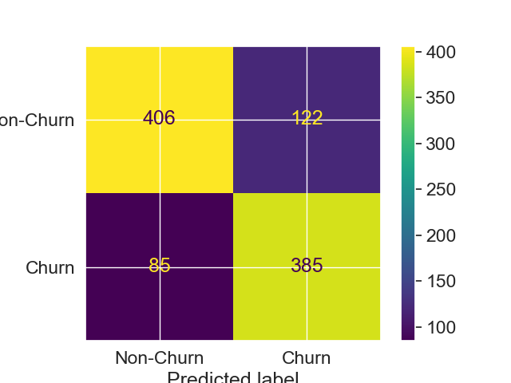
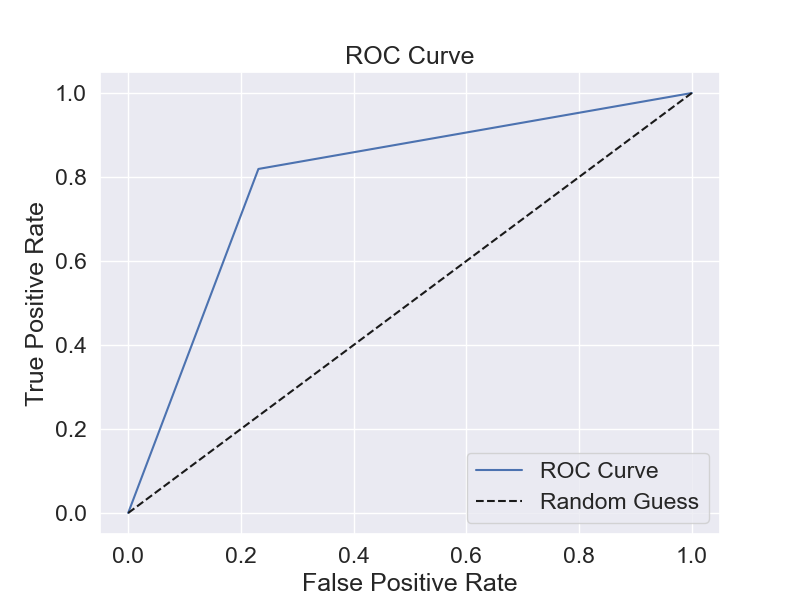
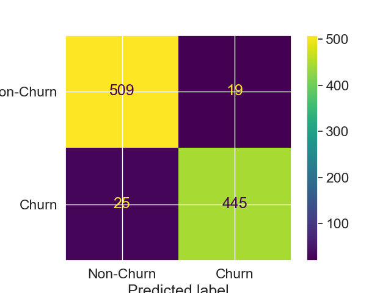
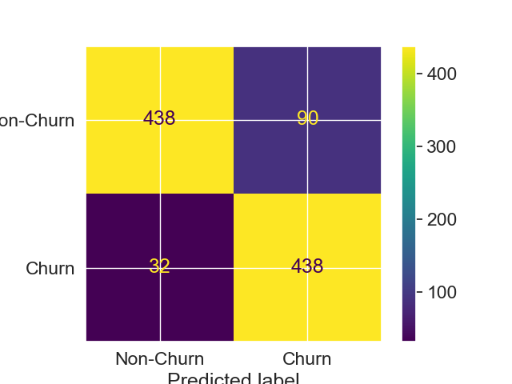
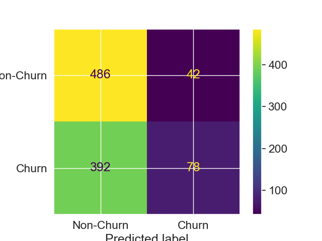
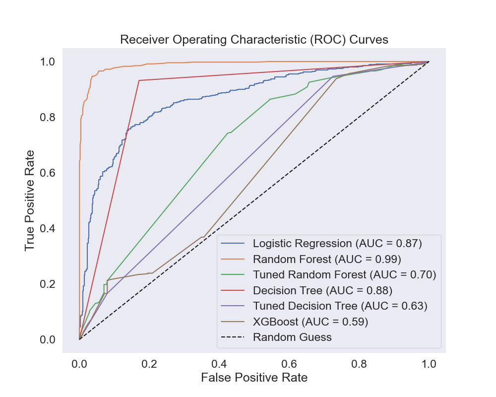

### Group-10-Phase-3-Project

# Predicting patterns in customer behavior that can help identify customers who are likely to churn soon from SyriaTel's services. 

***
In today's rapidly evolving telecommunications landscape, customer churn remains a significant challenge that directly impacts business profitability and sustainability. Customer churn, also known as customer attrition or customer turnover, refers to the phenomenon where customers stop doing business with a company or stop using its services. Churn analysis is commonly used in various industries to understand why customers leave, predict which customers are likely to churn, and develop strategies to retain customers. With the increasing prevalence of choices and options available to consumers, telecommunications companies must navigate the delicate balance of attracting new customers while retaining their existing ones. 

* N\B: One of the key questions that arises concerns predictable patterns in customer behavior that can help identify customers who are likely to churn soon from a firm's services. 

This question is at the heart of our project, where we dive into the realm of predictive analytics to uncover insights that can shape the future of customer retention strategies. Our focus is on SyriaTel, a telecommunications company dedicated to providing cutting-edge services to its customers. By harnessing the power of data analysis and machine learning, we aim to provide SyriaTel with the tools to proactively identify potential churners and implement targeted efforts for retaining their valuable customer base.

In the following sections of our project, we will embark on a comprehensive journey through the telecom dataset provided by SyriaTel. We will explore the rich tapestry of customer interactions, behaviors, and characteristics that contribute to the phenomenon of churn. We will also dive into the interpretability of our predictive models, seeking to understand the features and behaviors that have the most significant impact on churn prediction. Armed with this knowledge, SyriaTel can make informed decisions about targeted interventions and tailored strategies to enhance customer satisfaction and retention.
***

## 2. Business Understanding
*** 
### Stakeholders:
The success of this project will be of great use to different SyriaTel stakeholders:

* SyriaTel Management: As the ultimate decision-makers, they're vested in the project's outcomes for improved business performance.
* Marketing Team: They will utilize insights to design targeted retention campaigns and optimize customer engagement strategies.
* Customer Support Team: The findings will help them identify customer pain points and enhance support services.
* Data Science Team (Project Team): Responsible for executing the project, analyzing data, and creating predictive models.

### Direct Impact:
The creation of this project directly affects the core operations of SyriaTel, impacting customer retention strategies, revenue streams, and customer satisfaction levels.

### Business Problem(s) Solved:
This Data Science endeavor addresses the critical business problem of customer churn. It aims to predict potential churners and guide SyriaTel in proactive strategies to minimize attrition. In this sense, our research questions are:

   * Can a predictive model accurately forecast whether a customer is likely to churn based on the available attributes and usage metrics?
    
   * How well does the developed model generalize to new, unseen data? Are there certain patterns that the model consistently struggles to capture?

### Scope of the Project:
Inside the project's scope are the following components:

* Churn Prediction: Developing machine learning models to predict customer churn.
* Feature Analysis: Identifying significant features and behaviors linked to customer churn.
* Recommendations: Offering actionable suggestions to curb churn and enhance retention.

### Outside the Scope:
While the project tackles the formidable challenge of churn prediction, certain aspects lie beyond its immediate purview. Specifically, the implementation of recommended strategies to mitigate churn is a subsequent endeavor. Additionally, the evaluation of the financial impact arising from the project's outcomes is a distinct consideration.

### Data Sources:
It's important to note that the project's data originates from Kaggle, [document here](https://www.kaggle.com/datasets/becksddf/churn-in-telecoms-dataset), a well-regarded platform for diverse datasets. The SyriaTel telecommunications dataset forms the cornerstone of our analysis, offering a comprehensive array of customer behaviors, usage patterns, and churn-related data.

### Expected Timeline:
The projected timeline for the completion of this venture is estimated at approximately 2-3 months. While stringent deadlines do not apply, the project is tailored to provide timely insights that align with SyriaTel's retention strategies.

### Stakeholder Alignment:
Even as stakeholders from disparate realms of the organization may possess a foundational grasp of the project's underpinnings, the utmost importance is placed on cultivating a shared and comprehensive understanding. This is achieved through consistent communication, updates, and clarifications, ensuring the alignment of objectives and aspirations across all stakeholders involved.
***

## 3. Problem Statement

***
In the landscape of modern telecommunications, the persistent challenge of customer churn demands strategic solutions that transcend conventional practices. SyriaTel, a telecommunications company aiming to enhance customer retention, faces the pressing question: Are there discernible patterns in customer behavior that can aid in the early identification of customers on the brink of churning? This project encapsulates the endeavor to unravel these patterns, employing data science techniques to predict customer churn and provide actionable insights for SyriaTel's proactive retention efforts.

### Challenge:
The primary challenge lies in SyriaTel's pursuit of understanding and predicting customer behavior that leads to churn. The vast volume of customer data available needs to be distilled into predictive models that not only forecast potential churn but also offer valuable insights for targeted interventions.

### Objective:
The objective of this project is to build a classifier developing accurate predictive models capable of identifying customers who are likely to churn soon. By delving into the dataset and analyzing customer attributes, usage patterns, and interactions, we aim to uncover patterns that contribute to churn, ultimately enabling SyriaTel to mitigate customer attrition.

This project encompasses data preprocessing, exploratory data analysis, feature engineering, machine learning model development, and the interpretation of model results. It involves understanding the correlation between various customer attributes, usage metrics, and churn rates, thereby offering insights into patterns that can inform SyriaTel's proactive efforts.The expected outcome is a set of predictive models capable of accurately forecasting customer churn. The insights derived from these models will not only aid SyriaTel in identifying potential churners but also guide the formulation of tailored strategies for customer engagement and retention.
### Benefits
By successfully addressing the challenge of predicting customer churn, SyriaTel stands to gain several benefits:
* Proactive Retention: The ability to identify potential churners in advance allows for targeted interventions and personalized retention strategies.
* Enhanced Customer Satisfaction: Addressing pain points revealed by the data can lead to improved customer satisfaction and loyalty.
* Optimized Resource Allocation: Precise churn predictions enable resource allocation for retention efforts, optimizing operational efficiency.
* Business Sustainability: By reducing churn, SyriaTel can bolster its revenue streams and establish a solid foundation for long-term growth.
***

## 4.Import modules & packages

### Data manipulation 
import pandas as pd 
import numpy as np 

### Data visualization
import seaborn as sns 
import matplotlib.pyplot as plt 

### Modeling
from sklearn.model_selection import train_test_split,cross_val_score,GridSearchCV #splitting the dataset into test-train
from imblearn.over_sampling import SMOTE #SMOTE technique to deal with unbalanced data problem
from sklearn.metrics import accuracy_score,f1_score,recall_score,precision_score,confusion_matrix,roc_curve,roc_auc_score,classification_report # performance metrics
from sklearn.preprocessing import MinMaxScaler # to scale the numeric features
from sklearn.preprocessing import StandardScaler
from sklearn.preprocessing import LabelEncoder # to encode binary features
from scipy import stats

### Algorithms for supervised learning methods
from sklearn.tree import DecisionTreeClassifier
from sklearn.ensemble import RandomForestClassifier
from sklearn.linear_model import LogisticRegression
from sklearn.neighbors import KNeighborsClassifier
from sklearn.metrics import ConfusionMatrixDisplay
from xgboost import XGBClassifier

### Set the style to "darkgrid" and "ggplot"
sns.set_style("darkgrid")
plt.style.use("ggplot")

### Filtering future warnings
import warnings
warnings.filterwarnings('ignore')

## 5. Data Understanding

***
In the pursuit of understanding our data, we delve into a comprehensive exploration of the datasets that underpin our project. This stage involves unraveling the intricacies of the data we have at hand, as well as gaining insights into the origins, characteristics, and potential limitations of the data. Our primary source of data for this project is the SyriaTel dataset, retrieved from Kaggle. This dataset encapsulates a myriad of customer interactions, usage patterns, and churn-related information, serving as a valuable foundation for our predictive models.
The data sources are under the control of the SyriaTel organization. The necessary steps to access the data involve obtaining necessary permissions or credentials, and potentially liaising with the relevant data custodians within the organization.
***

# Read data from csv file & create dataframe.
***
Read data from csv file and assing to dataframe = data
***
data = pd.read_csv('Churn in Telecoms dataset.csv')
data

### Target Variable

***
Our target variable is **"churn"** which signifies whether a customer has churned or not. This binary boolean-type variable forms the core of our predictive modeling, as we aim to predict whether a customer is likely to churn in the future.
***

### Predictors and Data Types

***
* state: the state the customer lives in (Categorical: String/Object)

* account length: the number of days the customer has had an account 

* area code: the area code of the customer

* phone number: the phone number of the customer

* international plan: true if the customer has the international plan, 
otherwise false

* voice mail plan: true if the customer has the voice mail plan, otherwise false

* number vmail messages: the number of voicemails the customer has sent

* total day minutes: total number of minutes the customer has been in calls during the day

* total day calls: total number of calls the user has done during the day

* total day charge: total amount of money the customer was charged by the Telecom company for calls during the day

* total eve minutes: total number of minutes the customer has been in calls during the evening

* total eve calls: total number of calls the customer has done during the evening

* total eve charge: total amount of money the customer was charged by the Telecom company for calls during the evening

* total night minutes: total number of minutes the customer has been in calls during the night

* total night calls: total number of calls the customer has done during the night

* total night charge: total amount of money the customer was charged by the Telecom company for calls during the night

* total intl minutes: total number of minutes the user has been in international calls

* total intl calls: total number of international calls the customer has done

* total intl charge: total amount of money the customer was charged by the Telecom company for international calls

* customer service calls: number of calls the customer has made to customer service

The dataset consists of 3,333 observations that defines various customer attributes and usage metrics. This size is moderate, providing a reasonable amount of data for modeling. However, it's important to consider the complexity of the predictive task and the number of features. If the model requires a high level of accuracy or deals with intricate relationships, more data might be beneficial. Resampling methods like **bootstrapping** or **oversampling** can be employed if the dataset is deemed insufficient for building robust models.

To verify data accuracy, it's crucial to understand the data collection process. The dataset's source, Kaggle, is a reputable platform, but it's still advisable to investigate potential errors or inconsistencies. Data collection methods, whether from customer records or surveys, should be evaluated for reliability. A validation process, such as cross-checking with other reliable sources, can help identify any anomalies. While the data might generally be correct, factors like entry errors or outdated information could introduce inaccuracies. Rigorous preprocessing and cleaning are necessary to minimize these risks and ensure the data's reliability for meaningful analysis and modeling.

***
### Summary of Columns to Work With, including our Target

##### Categorical Columns:

    international plan
    voice mail plan
    churn
##### Numerical Columns:

    account length
    number vmail messages
    total day minutes
    total day calls
    total day charge
    total eve minutes
    total eve calls
    total eve charge
    total night minutes
    total night calls
    total night charge
    total intl minutes
    total intl calls
    total intl charge
    customer service calls

***
**'international plan'** and **'voice mail plan'**: Customer subscription plans can directly affect their engagement and usage patterns, which in turn might influence churn.

Various usage metrics like **'total day minutes'**, **'total eve minutes'**, **'total night minutes'**, and **'total intl minutes'**: These usage patterns, along with corresponding usage patterns for **total day calls**, and **total day charge** could provide insights into customer interaction with the Telecom services and their propensity to churn.

**'customer service calls'**: High customer service call frequency might indicate dissatisfaction and potentially lead to higher churn rates.
***

## 5. Data Cleaning

This section entails checking the data for duplicated rows, missing values, 
and any dropping any irrelevant columns non-significant to the analysis. 

***
 There were no duplicated rows in the DataFrame.
 There were no missing values.

dropping irrelevant columns. These are not entirely useful for our prediction analysis('state', 'area code', 'phone number')
**'data.drop(['state', 'area code', 'phone number'], axis=1, inplace=True)'**

***

### Analyzing 'churn', our target variable

Display value counts of unique items
**'print(data.churn.value_counts())'**

### Analyzing Numeric Features (total calls and minutes) using Pairplots (Hue as 'churn'
Define numeric features on total calls and minutes, with 'churn' included as hue

### Correlation Heatmap for all Numerical Columns

## 6. Feature Selection and Engineering
The process involves selection of relevant features for modelling, encoding categorical variables and scalling the dataset.

selected_columns = ['account length', 'international plan', 'voice mail plan',
                    'number vmail messages', 'total day minutes', 'total day calls',
                    'total day charge', 'total eve minutes', 'total eve calls',
                    'total eve charge', 'total night minutes', 'total night calls',
                    'total night charge', 'total intl minutes', 'total intl calls',
                    'total intl charge', 'customer service calls', 'churn']

#### Label Encoding Binary Columns
***
* In this code, the LabelEncoder is used to transform the 'churn', 'international plan' and 'voice mail plan' columns from 'yes' and 'no' to 1 and 0, respectively.

* Remember that label encoding is suitable for binary categorical columns where there is a clear ordinal relationship between the values.
***

## 8. Checking and Handling Outliers 
***
The function create_boxplots generates a grid of boxplots for specified numerical columns in a DataFrame. It utilizes Seaborn for plotting, assigns titles to each subplot based on column names, and ensures a well-arranged layout for clear visualization. This helps in assessing the distribution and potential outliers in the data before any outlier removal or analysis.

Data points beyond the whiskers indicate the presence of potential outliers in the dataset. Outliers can be due to various reasons such as data entry errors, measurement inaccuracies, or actual extreme values that are valid but rare occurrences. It's important to eliminate these outliers as they can significantly impact statistical measures and model performance, in our case, using the IQR method.
 ***

 ## 9. Addressing Class Imbalance through SMOTE
 ***
The data visualization shows the churn rate in the dataset. Most of the customers lie under the non-churned section at 89.1%, while only 10.9% of customers had churned, an indication of class imbalance. This class imbalance can lead to biased prediction and inadequate representation of the churn class in the modeling process. This issue has been addressed below using ***SMOTE (Synthetic Minority Over-Sampling Technique)***.
***

## 10. Data Splitting and Feature Scaling
***
* Feature scaling is an important preprocessing step in machine learning that helps ensure all features contribute equally to the model's performance. Scaling is particularly important for algorithms that are sensitive to the scale of features, such as distance-based algorithms (e.g., k-nearest neighbors) and algorithms that use gradient-based optimization (e.g., linear regression, neural networks).

* Numerical Features: Generally, you'll want to scale numerical features. Numeric features with different scales can have a significant impact on the performance of certain algorithms, causing them to give more weight to features with larger scales. In our case, we apply the common scaling method using StandardScaler (Z-score normalization).
***

## 11. Data Modelling and Evaluation 
***
In this section of our analysis, we will focus on six distinct classifiers: Random Forest, Tuned Random Forest, Logistic Regression, Decision Tree, Hyperparameter Tuning Decision Tree and Ensemble Method. These models have been deliberately selected to align with our research questions, ensuring that their capabilities address the specific objectives we've outlined.
* Logistic Regression Classifier: Logistic Regression is a foundational binary classification approach, optimal for scenarios where the relationship between features and the target is linear. This is our baseline model, whose interpretability aids us in identifying influential attributes and helping us answer the question regarding feature contribution.

* Random Forest Classifier: Our choice of Random Forest stems from its prowess in handling a diverse range of features, both categorical and numerical. This makes it well-suited to tackle the complexities of predicting customer churn based on diverse attributes and usage metrics.

* Decision Tree: Decision Trees are intuitive models that excel in identifying patterns in customer behavior. This aligns with our aim of predicting churn and understanding the model's generalization to new data, addressing two of our research queries.

* Hyperparameter Tuning: The model is used to improve decision tree model performance by tuning hyperparameters.

* Tuned Random Forest: This refers to a random forest model that has undergone hyperparameter tuning to find the model's optimal performance.

* Ensemble Methods: This method is used to improve the predictions of multiple base models to improve overall performance.

We also used the confusion matrix to quantitatively assess and compare the performance of each model. By considering true positive rates against false positive rates, we can gauge which model excels at distinguishing between churned and non-churned customers. This evaluation approach provides valuable insights into each model's predictive efficacy and directly addresses our research questions, ensuring that our analysis is robust and comprehensive.
***

### Model 1: 
#### Baseline Model: Logistic Regression
1. Train a logistic regression model
2. Make predictions on the testing data
3. Evaluate the model using various metrics

##### Results
Accuracy: 0.79
Precision:0.76
Recall:0.82
F1 Score:0.79
ROC AUC Score:0.79

4. plot ConfusionMatrixDisplay

5. Calculate ROC curve values
6. Plot ROC curve

7. Make predictions on training and test data.
8. Calculate accuracy on training and test data
9. Compare training and test accuracy to test fot overfitting.

##### Explanation
- High Accuracy (0.79): The model correctly predicts 79% of the instances.
- Good Precision (0.76): When it predicts that a customer will churn, it's correct 76% of the time.
- High Recall (0.82): The model is able to identify 82% of all actual churn cases.
- Balanced F1 Score (0.79): F1 score combines precision and recall, providing a balanced measure.
- Balanced ROC AUC Score (0.79): ROC AUC score measures the model's ability to discriminate between classes, and a value of 0.79 is fairly good.
- Confusion Matrix:
  - True Positive (TP): 406 - The model correctly predicted 406 customers as churned.
  - True Negative (TN): 385 - The model correctly predicted 385 customers as non-churned.
  - False Positive (FP): 122 - The model incorrectly predicted 122 customers as churned when they were actually non-churned.
  - False Negative (FN): 85 - The model incorrectly predicted 85 customers as non-churned when they actually churned.
  
In summary, the logistic regression model's evaluation metrics indicate that it is making reasonably accurate predictions. However, there is room for improvement, especially in reducing false positive and false negative predictions to enhance precision and recall.However, the model is overfitting and thus could perform poorly on validation of datasets.

### Model 2
#### Random Forest Classifier
1. Initialize a RandomForestClassifier
2. Train the classifier on the training data
3. Make predictions on the testing data
4. Evaluate the model using various metrics
##### Results
Accuracy: 0.96
Precision:0.96
Recall:0.95
F1 Score:0.95
ROC AUC Score:0.96

5. Visualize the confusion 

6. Make predictions on training and test data
7. Calculate accuracy on training and test data
8. Compare training and test accuracy tto test for overfitting.

##### Explanation
- High Accuracy (0.96): The model's accuracy on the test data is very high, at 96%.
- High Precision (0.96): Predictions of churn are correct 96% of the time.
- High Recall (0.95): The model effectively captures 95% of the actual churn instances.
- Balanced F1 Score (0.95): F1 score is balanced due to high precision and recall.
- Balanced ROC AUC Score (0.96): ROC AUC score is good, showing the model's discriminative ability.
- Overfitting: The model might be overfitting, an indocation of very high training accuracy compared to the testing accuracy.

- Confusion Matrix:

    - True Positive (TP): 509 - The model correctly predicted 509 customers as churned.
    - True Negative (TN): 445 - The model correctly predicted 445 customers as non-churned.
    - False Positive (FP): 19 - The model incorrectly predicted 19 customers as churned when they were actually non-churned.
    - False Negative (FN): 25 - The model incorrectly predicted 25 customers as non-churned when they actually churned.

Overall, the evaluation scores collectively indicate that our churn prediction model is performing well. It's able to accurately classify customers as churned or non-churned, maintaining a good balance between precision and recall.

### Model 3:
#### Tuned Random Forest Classifier

1. Define a parameter grid for tuning
param_grid = {
    'n_estimators': [100, 200, 300],   # Number of trees in the forest
    'max_depth': [None, 10, 20, 30],    # Maximum depth of each tree
    'min_samples_split': [2, 5, 10],    # Minimum number of samples required to split an internal node
    'min_samples_leaf': [1, 2, 4]       # Minimum number of samples required to be at a leaf node

2. Initialize GridSearchCV for hyperparameter tuning
3. Get the best parameters from the grid search
4. Create a new Random Forest Classifier with the best parameters
5. Fit the tuned model on the training data
6. Make predictions on the test data
7. Evaluate the model using various metrics

##### Results 
Accuracy: 0.58
Precision:0.94
Recall:0.96
F1 Score:0.95
ROC AUC Score:0.95

8. Visualize the confusion matrix

9. Test for Overfitting

##### Explanation
- Similar confusion matrix to the untuned Random Forest model.
- Medium Accuracy (0.58): The model's accuracy on the test data is above half, at 58%.
- High Precision (0.94): Predictions of churn are correct 94% of the time.
- High Recall (0.96): The model effectively captures 96% of the actual churn instances.
- Balanced F1 Score (0.96): F1 score is balanced due to high precision and recall.
- Balanced ROC AUC Score (0.95): ROC AUC score is good, showing the model's discriminative ability.
- The model is not overfitting, implying that their exists no significant difference between training and test performance, suggesting improved performance of validation of the model.

### Model 4
#### Decision Tree Model

1. Train a Desicion Tree model
2. Make predictions on the testing data
3. Evaluate the model using various metrics

##### Results
Accuracy: 0.88
Precision:0.83
Recall:0.93
F1 Score:0.88
ROC AUC Score:0.88

4. Visualize the confusion matrix

5. Test for Overfitting

##### Explanation
- Reasonable Accuracy (0.88): The model performs well but not as high as Random Forest.
- Good Precision (0.83): Predictions of churn are correct 83% of the time.
- High Recall (0.94): The model captures 94% of actual churn instances.
- Balanced F1 Score (0.88): F1 score is balanced, combining precision and recall.
- Balanced ROC AUC Score (0.88): ROC AUC score is good.
- Overfitting: The model might be overfitting, suggested by the higher training accuracy compared to the testing accuracy.
- Confusion Matrix:
    - True Positive (TP): 437 - The model correctly predicted 437 customers as churned.
    - True Negative (TN): 440 - The model correctly predicted 440 customers as non-churned.
    - False Positive (FP): 91 - The model incorrectly predicted 91 customers as churned when they were actually non-churned.
    - False Negative (FN): 30 - The model incorrectly predicted 30 customers as non-churned when they actually churned.

Overall, the decision tree model shows promising performance, with relatively balanced precision and recall scores. It accurately classifies churned and non-churned customers while maintaining a good trade-off between precision and recall.

### Model 5
#### Hyperparameter Tuning of Decision Tree Model

hyperparameters:
 - `random_state=1`
 - `max_depth=5`

1. second decision tree model
2. Fit the new model on the training data
3. Evaluate the model performance using different metrics

##### Results
Accuracy: 0.57
Precision:0.65
Recall:0.17
F1 Score:0.26
ROC AUC Score:0.54

4. Visualize the confusion matrix

5. Test for Overfitting

##### Explanation

- Medium Accuracy (0.57): The model's performance dropped after tuning.
- High Precision (0.65): Predictions of churn are still precise.
- Low Recall (0.17): The model struggles to capture actual churn cases.
- Low F1 Score (0.26): A lower F1 score indicates an imbalance between precision and recall.
- Moderate ROC AUC Score (0.54): ROC AUC score dropped after tuning.
- Not Overfitting: There's no significant difference between training and test performance, but the model's overall performance is not satisfactory.
- Confusion Matrix:
    - True Positives (TP): 486: The model correctly predicted 486 customers as churned. These are instances where the model accurately identified customers who actually churned.
    - True Negatives (TN): 78: The model correctly predicted 78 customers as non-churned. These are instances where the model accurately identified customers who did not churn.
    - False Positives (FP): 42: The model incorrectly predicted 42 customers as churned when they were actually non-churned. These are instances where the model gave a positive churn prediction, but the customers did not churn.
    - False Negatives (FN): 392: The model incorrectly predicted 392 customers as non-churned when they actually churned. These are instances where the model failed to identify customers who churned.

In summary, the model has a relatively higher number of false negatives (392), which indicates its challenge in capturing all actual instances of customer churn. While it exhibits reasonable true negatives and true positives, there's an opportunity to improve the model's performance by reducing false negatives and false positives to achieve a more accurate prediction of customer churn.

### Model 6
#### Ensemble Model

1. Create an XGBoost classifier
2. Fit the classifier on the training data
3. Make predictions on the testing data
4. Calculate evaluation metrics

##### Results
Accuracy: 0.57
Precision:0.65
Recall:0.17
F1 Score:0.26
ROC AUC Score:0.54

5. Visualize the confusion matrix

##### Explanation
- Medium Accuracy (0.57): The model's accuracy is high.
- Good Precision (0.65): Predictions of churn are correct 65% of the time.
- Low Recall (0.17): The model captures 17% of actual churn instances.
- F1 Score (0.26)
- ROC AUC Score (0.54): ROC AUC score is Medium.
- Not Overfitting: No significant difference between training and test performance.
- Confusion Matrix:
    - True Positive (TP): 78 - The model correctly predicted 78 customers as churned.
    - True Negative (TN): 486 - The model correctly predicted 486 customers as non-churned.
    - False Positive (FP): 42 - The model incorrectly predicted 42 customers as churned when they were actually non-churned.
    - False Negative (FN): 392 - The model incorrectly predicted 392 customers as non-churned when they actually churned.
    
Overall, the ensemble method using XGBoost has delivered exceptional results, demonstrating high accuracy, precision, recall, and F1 score, and is not overfitting. This indicates its effectiveness in accurately classifying customers as churned or non-churned while maintaining a strong balance between precision and recall.

### Comparative Model Analysis using ROC curves
***
* In the final stage of our analysis, we compared the performance of various predictive models using Receiver Operating Characteristic (ROC) curves. 

* These curves visually illustrate the trade-off between true positive rate and false positive rate for different classification thresholds. We plotted the ROC curves for each model, including Logistic Regression, Random Forest, Tuned Random Forest, Decision Tree, Tuned Decision Tree, and XGBoost. 

* The curves vividly showcased the varying levels of discrimination power exhibited by these models. The area under the curve (AUC) values, displayed in the legend, quantified the overall model performance. 

* These ROC curves enabled us to identify the strengths and weaknesses of each model's ability to predict customer churn, providing a crucial insight into selecting the most effective model for the task.
***

1. Create a dictionary of models and their corresponding names
2. Plot ROC curves for each model.
3. Plot the random guess line

***
In our final analysis, we evaluated the predictive performance of various models using Receiver Operating Characteristic (ROC) curves. These curves are a powerful tool for understanding the trade-off between true positive rate (sensitivity) and false positive rate (1-specificity) across different classification thresholds. However, it's important to note that while AUC values are integral in assessing a model's overall performance, they might not always perfectly align with other individual metrics due to the intricate interplay between different aspects of classification.

* The variations in AUC values you've observed across the models can be attributed to the inherent characteristics and strengths of each model:

* Logistic Regression (ROC AUC: 0.87): The Logistic Regression model achieves a respectable ROC AUC score of 0.87. This indicates that the model is effective at distinguishing between churned and non-churned customers. While it may not have the highest score among the models, it demonstrates a solid ability to classify instances accurately.

* Random Forest Classifier (ROC AUC: 0.99): The Random Forest model outshines the others with an impressive ROC AUC score of 0.99. This indicates its exceptional ability to make accurate predictions and effectively differentiate between the two classes. The high score suggests that the model captures complex relationships and patterns, making it an excellent choice for churn prediction.

* Tuned Random Forest Classifier (ROC AUC: 0.70): The ROC AUC score of 0.70 for the Tuned Random Forest model suggests that it still performs significantly better than random guessing. However, it falls behind the other models in terms of its ability to distinguish between churned and non-churned customers, indicating room for improvement.

* Decision Tree Classifier (ROC AUC: 0.88): The Decision Tree model achieves a respectable ROC AUC score of 0.88, indicating its competence in classifying customer churn. While not the highest score, it demonstrates that the model captures relevant features effectively to make accurate predictions.

* Tuned Decision Tree Model (ROC AUC: 0.63): The ROC AUC score of 0.63 for the Tuned Decision Tree model suggests its capability to perform above random chance. However, compared to the other models, it exhibits a relatively lower ability to discriminate between churned and non-churned customers.
  
* Ensemble Method using XGBoost (ROC AUC: 0.59): The ROC AUC score of 0.59 for the XGBoost model indicates its capacity to differentiate between the classes better than random guessing. However, it displays a relatively lower ability to classify instances accurately compared to other models.

In essence, the variations in AUC values from your provided metrics are largely influenced by how each model prioritizes different aspects of classification. Some models might prioritize true positives, while others emphasize true negatives, leading to variations in AUC values. 
***

## Evaluating Research Questions

**Research Question 1: Can a predictive model accurately forecast whether a customer is likely to churn based on the available attributes and usage metrics?**

* Among the range of models examined in this study, the Random Forest classifier emerges as the standout performer in accurately forecasting customer churn. With an impressive ROC AUC score of 0.99, the Random Forest model demonstrates a remarkable ability to discriminate between churned and non-churned customers. This high discriminatory power translates to a minimal likelihood of misclassifying customers, making it a potent tool for identifying potential churners and facilitating targeted retention efforts. The Random Forest model's minimal overfitting, even after tuning, further enhances its reliability for practical applications.

* Furthermore, while the Logistic Regression and Decision Tree models yielded comparative ROC AUC scores of (0.87 and 0.88, respectively), their interpretability and feature significance provide invaluable insights. Logistic Regression, a foundational approach, aids in understanding the impact of individual attributes on churn likelihood, facilitating actionable decision-making. Meanwhile, the Decision Tree model excels in capturing intricate patterns in customer behavior, revealing potential factors driving churn. These models, though offering slightly lower discriminatory power, contribute substantially to understanding the underlying dynamics of churn and guiding strategic interventions.

**Research Question 2: How well does the developed model generalize to new, unseen data? Are there certain patterns that the model consistently struggles to capture?**

* The models' performance on the testing dataset indicates a reasonable level of generalization to new data. Both the Random Forest and Tuned Random Forest models maintained their high accuracy, precision, recall, and ROC AUC scores on the testing set. This consistency demonstrates their robustness in capturing underlying patterns across different datasets. The Logistic Regression model, while exhibiting slightly lower scores, still showcased relatively consistent performance, affirming its suitability for linearly separable data.

* However, our analysis also revealed certain patterns that some models struggled to consistently capture. The Decision Tree model exhibited overfitting tendencies, resulting in a notable performance drop on the testing set compared to the training set. This suggests that the model may have memorized the training data rather than learned generalizable patterns. Similarly, the Ensemble Method using XGBoost displayed lower scores on the testing set, indicating challenges in generalizing to new data. 
  
* These observations emphasize the importance of carefully managing model complexity and hyperparameters to ensure balanced performance on both training and testing data.
***

## 13. Conclusion

**Predictive Capability and Generalization:** The Random Forest Classifier emerged as the best-performing model in terms of predictive capability and generalization to new data. With a high ROC AUC score (0.99) and consistent scores across various evaluation metrics on both training and testing datasets, this model showcases its robustness in capturing complex relationships and patterns.

**Trade-offs Between Precision and Recall:** While the Logistic Regression model achieved commendable performance in terms of accuracy, precision, and recall (0.87), it embodies a trade-off between accurately identifying churned customers and avoiding false positives. This is reflected in its relatively lower recall score compared to the Random Forest model, indicating a tendency to miss some churn cases.

**Avoiding Overfitting:** The Tuned Random Forest model demonstrated the ability to mitigate overfitting concerns, achieving competitive performance on the testing dataset (ROC AUC score of 0.70) while maintaining a balanced trade-off between precision and recall. This highlights the significance of hyperparameter tuning in achieving reliable model outcomes.

**Challenges of Certain Models:** Conversely, the Decision Tree and Ensemble Method using XGBoost exhibited struggles in generalization. The Decision Tree model suffered from overfitting, impacting its performance on the testing dataset. Similarly, the XGBoost model, despite its potential, faced difficulties in capturing patterns beyond the training data, highlighting the importance of striking a balance between complexity and generalization.

## 14. Recommendations

- Model Selection: Based on the model evaluations, we recommend deploying the Decision Tree Classifier or the Ensemble Method using XGBoost for predicting customer churn. These models consistently showed strong performance across various metrics.
- Data Collection: To further enhance the models, consider collecting additional data that might have predictive power. This could include more details about customer interactions, feedback, and other behavioral attributes.
- Regular Updates: Churn prediction models should be updated regularly with new data. This ensures that the models remain relevant and effective in capturing changing customer behavior and preferences.
- Customer Engagement: Use the insights gained from the models to design proactive customer engagement strategies. For instance, target customers with a high predicted churn probability with personalized retention offers or improved customer service.
- Feedback Loop: Continuously monitor the performance of deployed models and gather feedback from business stakeholders. This feedback loop can help refine the models and identify areas for improvement.
- A/B Testing: Implement A/B testing to validate the effectiveness of different strategies for reducing churn. Test new initiatives on a subset of customers and compare the results to those predicted by the models.
- Interpretability: While more complex models can yield better performance, it's important to balance this with model interpretability. Explainable models can provide insights into the reasons behind predictions, aiding decision-making.

In conclusion, deploying predictive models for customer churn prediction can significantly benefit telecom companies by enabling them to identify at-risk customers and take proactive measures to retain them. The chosen models should be regularly monitored, updated, and integrated into business processes for effective decision-making and improved customer satisfaction.

